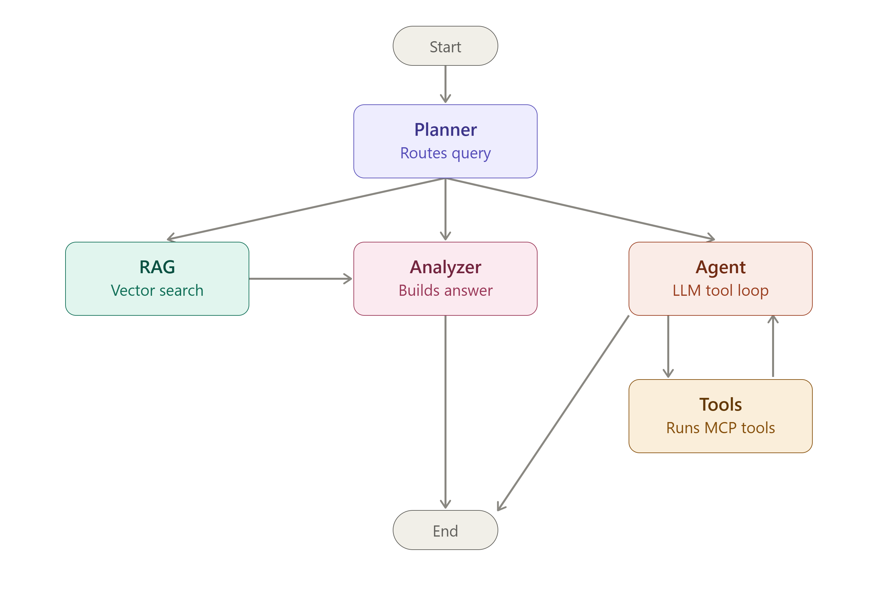
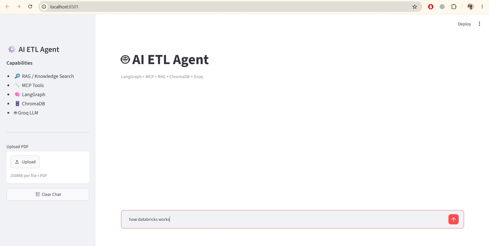
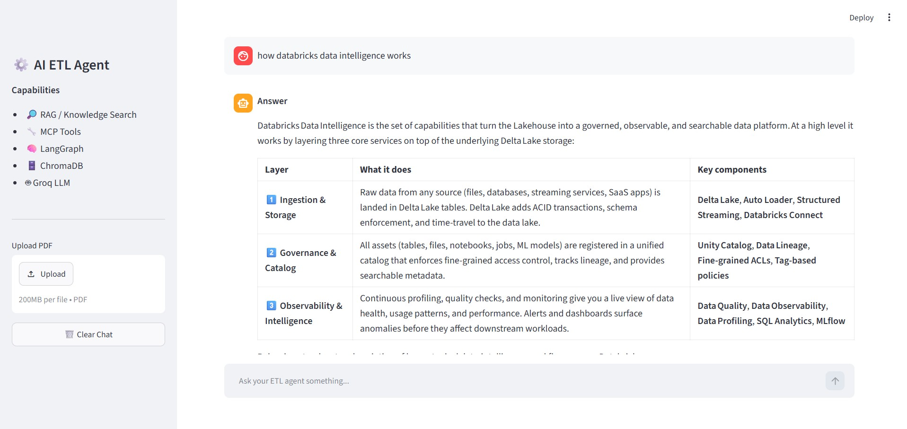
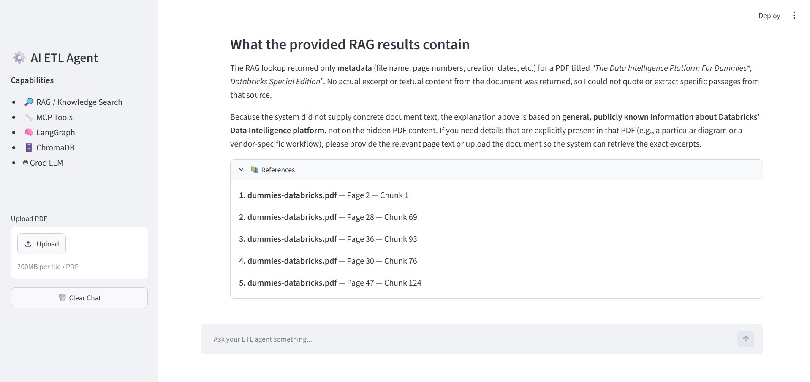
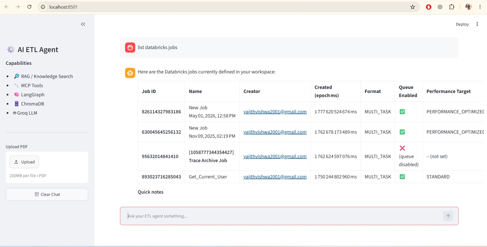

# AI ETL Agent 🤖

An intelligent ETL (Extract, Transform, Load) Chat Agent built with **LangGraph**, **LangChain**, and **Model Context Protocol (MCP)** servers. This agent can analyze user queries, retrieve contextual information from a knowledge base, interact with multiple data systems (Snowflake, Databricks, SQLite), and execute complex ETL operations.

## 🌟 Features

- **Intelligent Query Planning**: Automatically determines whether RAG (Retrieval-Augmented Generation) or external tools are needed
- **Multi-Source Integration**: Seamlessly connects to multiple data systems via MCP servers:
  - Snowflake for data warehousing
  - Databricks for job management and analytics
  - SQLite for local database operations
- **Knowledge Base Integration**: Built-in RAG pipeline with ChromaDB for document storage and retrieval
- **Conversational Interface**: Chat-based UI with Streamlit for easy interaction
- **Tool Execution**: Execute database queries, trigger jobs, and retrieve data programmatically
- **Context-Aware Responses**: Analyzes user queries and provides accurate, sourced responses

## 🏗️ Architecture

The agent uses a **LangGraph state machine** with the following workflow:

```
┌─────────────┐
│   START     │
└──────┬──────┘
       │
       ▼
┌─────────────────┐
│   Planner       │  (Determines needs_rag & needs_tools)
└──────┬──────────┘
       │
    ┌──┴──┐
    │     │
    ▼     ▼
  RAG   Agent
    │     │
    ▼     ▼
Analyzer  Tools → Agent (loop)
    │
    ▼
   END
```



**Node Responsibilities:**
- **Planner**: Analyzes user query and determines if RAG or tool execution is needed
- **RAG**: Retrieves relevant documents from the knowledge base
- **Agent**: Orchestrates LLM with tool access for complex operations
- **Tools**: Executes MCP tool calls (database queries, job triggers, etc.)
- **Analyzer**: Synthesizes information and generates final response

## 📦 Installation

### Prerequisites
- Python >= 3.11
- pip or [uv](https://docs.astral.sh/uv/) (recommended)

### Setup

```bash
# Clone the repository
git clone <repository-url>
cd AI.ETL.Agent

# Create virtual environment (using uv)
uv venv

# Activate virtual environment
source .venv/bin/activate  # On Windows: .venv\Scripts\Activate.ps1

# Install dependencies
uv sync
```

## ⚙️ Configuration

Create a `.env` file in the project root:

```env
# LLM Configuration
GROQ_API_KEY=your_groq_api_key

# Snowflake Configuration
SNOWFLAKE_ACCOUNT=your_account
SNOWFLAKE_USER=your_user
SNOWFLAKE_PASSWORD=your_password
SNOWFLAKE_DATABASE=your_database
SNOWFLAKE_SCHEMA=your_schema
SNOWFLAKE_WAREHOUSE=your_warehouse

# Databricks Configuration
DATABRICKS_HOST=your_databricks_host
DATABRICKS_TOKEN=your_databricks_token
```

## 🚀 Usage

### CLI Mode
Run the interactive chat interface in the terminal:

```bash
cd src
uv run ai_etl_agent.main
```

Then type queries like:
- "Why is the data pipeline failing?" (triggers RAG)
- "Run the daily ETL job" (triggers tool execution)
- "Show me jobs in Databricks" (tool execution)

### Web UI (Streamlit)
Launch the web interface:

```bash
uv run streamlit run ai_etl_agent/app.py
```

Access at `http://localhost:8501`

### As a Module
```python
from ai_etl_agent.main import main
import asyncio

asyncio.run(main())
```

## 📁 Project Structure

```
AI.ETL.Agent/
├── src/
│   ├── ai_etl_agent/          # Main agent code
│   │   ├── app.py              # Streamlit web interface
│   │   ├── main.py             # CLI entry point
│   │   ├── graph.py            # LangGraph state machine
│   │   ├── state.py            # Agent state definition
│   │   ├── mcp_client.py       # MCP client for tool integration
│   │   └── nodes/
│   │       ├── planner.py      # Query planning logic
│   │       ├── analyzer.py     # Result analysis
│   │       ├── agent.py        # LLM agent orchestration
│   │       ├── rag.py          # RAG node implementation
│   │       └── tool.py         # Tool execution
│   │
│   ├── knowledge_store/        # RAG & vectorstore
│   │   ├── embeddings/         # Embedding model management
│   │   ├── ingestion/          # Document loading & processing
│   │   │   ├── loader.py       # Load PDFs, docs
│   │   │   ├── cleaner.py      # Text cleaning
│   │   │   └── splitter.py     # Chunk documents
│   │   ├── vectorstore/        # ChromaDB integration
│   │   ├── content/            # Knowledge base documents
│   │   └── db/                 # ChromaDB storage
│   │
│   └── mcp_servers/            # MCP server implementations
│       ├── snowflake/          # Snowflake integration
│       │   ├── server.py
│       │   ├── tools/
│       │   │   └── queries.py
│       │   └── utils/
│       ├── databricks/         # Databricks integration
│       │   ├── server.py
│       │   ├── tools/
│       │   │   └── jobs.py
│       │   └── utils/
│       └── sqlite/             # SQLite integration
│           ├── server.py
│           ├── tools/
│           │   └── crud.py
│           └── connection/
│
├── pyproject.toml              # Project metadata & dependencies
├── README.md                   # This file
└── .env.example               # Environment variables template
```

## 🔌 MCP Servers

The agent connects to three MCP servers for external system integration:

### 1. **Snowflake MCP Server**
- **Location**: `src/mcp_servers/snowflake/`
- **Tools**:
  - `execute_query(query)`: Execute SQL queries on Snowflake
- **Config**: Uses Snowflake connection credentials from `.env`

### 2. **Databricks MCP Server**
- **Location**: `src/mcp_servers/databricks/`
- **Tools**:
  - `list_jobs()`: Get all Databricks jobs
  - `get_job_details(job_name)`: Retrieve specific job details
  - `trigger_dbx_job()`: Execute a job
- **Config**: Uses Databricks API token

### 3. **SQLite MCP Server**
- **Location**: `src/mcp_servers/sqlite/`
- **Tools**:
  - `execute_query(query)`: Execute SQL on local SQLite database
- **Config**: Configurable database path

## 📚 Knowledge Store & RAG

The agent uses ChromaDB for vector storage and semantic search:

### Ingestion Pipeline
```
Load Document → Clean Text → Split into Chunks → Generate Embeddings → Store in ChromaDB
```

**Modules:**
- **`embeddings.py`**: Uses sentence-transformers for semantic embeddings
- **`loader.py`**: Supports PDF, Markdown, and text documents
- **`cleaner.py`**: Removes noise, normalizes text
- **`splitter.py`**: Creates overlapping chunks for better context
- **`chroma.py`**: ChromaDB vector store wrapper

### Adding Documents
```python
from knowledge_store import ingest_file

ingest_file("path/to/document.pdf")
```

## 🧠 Agent State

The agent maintains a comprehensive state throughout execution:

```python
{
    "messages": [...],              # Conversation history
    "user_query": str,              # Original user query
    "plan": [str],                  # Execution plan steps
    "current_step": str,            # Current execution step
    "needs_rag": bool,              # Whether RAG is required
    "needs_tools": bool,            # Whether tools are needed
    "rag_results": [...],           # Retrieved documents
    "tool_results": [...],          # Tool execution results
    "analysis": str,                # Analysis of results
    "final_response": str,          # Response to user
    "requires_approval": bool,      # If user approval needed
}
```

## 🔄 Query Flow Examples

### Example 1: Documentation Question (RAG)
```
User: "Why is data pipeline failing?"
   ↓
Planner: "needs_rag=True, needs_tools=False"
   ↓
RAG: Retrieves relevant documentation
   ↓
Analyzer: Synthesizes response
   ↓
Response: "Based on documentation, the issue is..."
```

### Example 2: Job Execution (Tools)
```
User: "Run the daily ETL job"
   ↓
Planner: "needs_rag=False, needs_tools=True"
   ↓
Agent: Identifies Databricks tool needed
   ↓
Tools: Executes trigger_dbx_job()
   ↓
Agent: Confirms execution
   ↓
Response: "Job started successfully"
```

## 🛠️ Development

### Running Tests
```bash
# TODO: Add test suite
pytest tests/
```

## Screenshots









### Adding New Tools
1. Create a new MCP server in `src/mcp_servers/<system>/`
2. Implement tool functions in `tools/`
3. Update MCP client to load the server
4. Test tool availability

### Adding Custom Nodes
1. Create node function in `src/ai_etl_agent/nodes/`
2. Update `graph.py` to include new node
3. Add routing logic if needed

## 📋 Dependencies

**Core Dependencies:**
- `langchain` - LLM framework
- `langgraph` - State machine orchestration
- `langchain-groq` - Groq LLM integration
- `mcp` - Model Context Protocol
- `chromadb` - Vector database
- `streamlit` - Web UI framework
- `sentence-transformers` - Embedding model
- `snowflake-connector-python` - Snowflake integration

See `pyproject.toml` for complete dependency list.

## 🔐 Security

- Store sensitive credentials in `.env` (not in version control)
- Never commit `.env` to the repository
- Use environment variables for API keys
- Add `.env` to `.gitignore`

## 📝 License

This project is open source. See LICENSE file for details.

## 👤 Author

**YajithVishwa**
- Email: yajithvishwa2001@gmail.com

## 🤝 Contributing

Contributions are welcome! Please:
1. Fork the repository
2. Create a feature branch (`git checkout -b feature/new-feature`)
3. Commit changes (`git commit -m 'Add new feature'`)
4. Push to branch (`git push origin feature/new-feature`)
5. Open a Pull Request

## 📞 Support

For issues, questions, or suggestions, please open an issue on the GitHub repository.

## 🗂️ Additional Resources

- [LangGraph Documentation](https://langchain-ai.github.io/langgraph/)
- [LangChain Documentation](https://python.langchain.com/)
- [Model Context Protocol](https://modelcontextprotocol.io/)
- [ChromaDB Documentation](https://docs.trychroma.com/)
- [Streamlit Documentation](https://docs.streamlit.io/)

---

**Last Updated**: 2026-08-16
**Status**: Active Development 🚀
